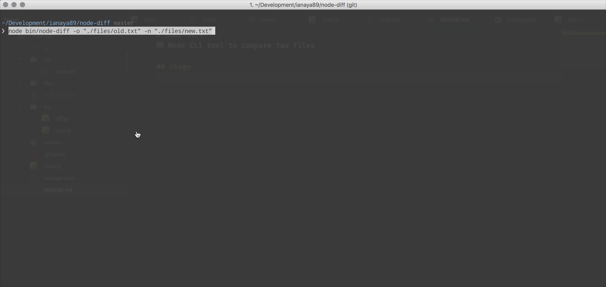

# node-diff
🔀 Node CLI tool to compare two files



## Local Usage
1. [Clone](git@github.com:ianaya89/node-diff.git) or download this project.
2. Install npm dependencies:

```bash
$ npm i

# or

$ yarn
```

3. Run `node-diff` setting arguments: `-o` (old file) and `-n` (new file).
```bash
$ node bin/node-diff -o "./files/old.txt" -n "./files/new.txt"

# or

$ npm start -- -o "./files/old.txt" -n "./files/new.txt"
```

## Global usage
🔜

## Options

```
Options:

-o --old <old-file>  old file path
-n --new <new-file>  new file path
-h, --help           output usage information
```

## License
[MIT License](https://github.com/ianya89/node-diff/blob/master/LICENSE)


## Style
[](http://standardjs.com)
